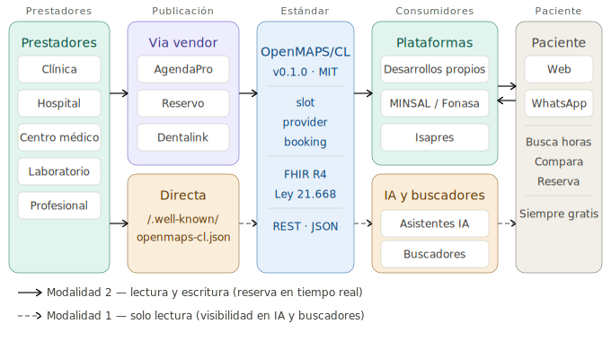

# OpenMAPS/CL — Open Medical Appointment Protocol Standard

**Estándar Abierto de Protocolo de Citas Médicas — Perfil Chile**

**Versión:** 0.1.0 &nbsp;|&nbsp; **Estado:** Borrador público &nbsp;|&nbsp; **Licencia:** MIT &nbsp;|&nbsp; **Autor:** Bernardo Cajales Millón
**Publicado:** Marzo 2026 &nbsp;|&nbsp; **Repositorio:** https://github.com/bcajales/openmaps-standard

---

## ¿Qué es OpenMAPS/CL?

OpenMAPS/CL es un estándar abierto que define un formato JSON común para el intercambio de datos de disponibilidad de horas médicas en Chile.

Permite que cualquier software de agenda médica publique su disponibilidad en un formato que cualquier buscador, organismo público, aseguradora o aplicación de terceros pueda consumir — sin necesidad de integraciones a medida entre cada par de sistemas.

---

## El problema que resuelve

Hoy, cada software de agenda médica en Chile habla un idioma propio. Una plataforma que quiera agregar disponibilidad de múltiples proveedores debe construir una integración distinta para cada uno. Esto genera:

- **Fragmentación para el paciente** — no existe un lugar único donde buscar y comparar horas entre prestadores
- **Duplicación de esfuerzo técnico** — cada integrador reimplementa la misma lógica desde cero
- **Dependencia tecnológica** — los prestadores quedan atados a un único proveedor de software para tener visibilidad

OpenMAPS/CL propone un formato único, abierto y bien documentado que cualquier vendor implementa una sola vez y que cualquier consumidor entiende sin acuerdos bilaterales.

---

## La analogía

GTFS (*General Transit Feed Specification*) estandarizó los datos de transporte público a escala mundial. Cualquier sistema de metro, bus o tren que publique GTFS puede ser consumido por cualquier aplicación — Google Maps, Moovit, Citymapper — sin negociar integraciones individuales.

OpenMAPS/CL aspira a hacer lo mismo para la disponibilidad de horas médicas en Chile.

---

## Relación con HL7 FHIR R4

OpenMAPS/CL es un **perfil simplificado de HL7 FHIR R4** para el caso de uso específico de agendamiento médico en Chile.

HL7 FHIR R4 es el estándar internacional adoptado por el MINSAL en el marco de la Ley 21.668. Define tres recursos para agendamiento que OpenMAPS/CL mapea directamente:

| Recurso FHIR R4 | Objeto OpenMAPS/CL |
|---|---|
| `Schedule` | `provider` |
| `Slot` | `slot` |
| `Appointment` | `booking_request` / `booking_response` |

La diferencia es de alcance y complejidad de implementación:

| Aspecto | FHIR R4 completo | OpenMAPS/CL |
|---|---|---|
| Infraestructura requerida | Servidor FHIR dedicado | REST sobre HTTP estándar |
| Tiempo de implementación | Semanas a meses | 3 a 5 días hábiles |
| Campos chilenos | Mediante extensiones FHIR | Nativos — RUT, Fonasa, GES, SIS-MINSAL |
| Audiencia principal | Sistemas de información hospitalaria | Vendors de agenda, agregadores, plataformas |

OpenMAPS/CL utiliza los mismos códigos de especialidad SIS-MINSAL definidos por el MINSAL y es consistente con la Guía de Implementación FHIR Chile. Está diseñado para complementar — no reemplazar — la interoperabilidad de fichas clínicas mandatada por la Ley 21.668.

Documentación técnica completa de la alineación: [`docs/alineacion-fhir.md`](docs/alineacion-fhir.md)

---

## Proyección internacional

OpenMAPS/CL es el primer perfil de la familia OpenMAPS. El sufijo `/CL` indica que corresponde al sistema de salud chileno. Futuros perfiles para otros países (`/CO` para Colombia, `/MX` para México y otros) seguirán la misma estructura conceptual, adaptando los campos locales sin alterar el modelo base.

---

## Estructura del esquema

### `slot` — Una hora médica disponible

```json
{
  "slot_id": "VENDOR-20260321-DER-001",
  "provider_id": "PROV-001",
  "specialty": {
    "sis_code": "10",
    "sis_name": "DERMATOLOGÍA"
  },
  "professional_name": "Dra. María González",
  "rut_professional": "15.234.567-8",
  "start_datetime": "2026-03-21T10:00:00-03:00",
  "end_datetime": "2026-03-21T10:30:00-03:00",
  "duration_minutes": 30,
  "status": "available",
  "modality": "in_person",
  "accepts_fonasa": true,
  "fonasa_accreditation_level": "2",
  "insurance_accepted": ["FONASA-B", "FONASA-C", "FONASA-D", "FONASA-LE", "ISAPRE", "PARTICULAR"],
  "libre_eleccion": true,
  "ges": { "is_ges": false },
  "base_price": 48000,
  "currency": "CLP",
  "_schema": "openmaps-cl/0.1"
}
```

### `provider` — Un prestador de salud

```json
{
  "provider_id": "PROV-001",
  "name": "Centro Médico Ejemplo",
  "provider_type": "medical_center",
  "rut_provider": "76.543.210-1",
  "accepts_fonasa": true,
  "fonasa_accreditation_level": "2",
  "libre_eleccion": true,
  "location": {
    "address": "Av. Providencia 1234",
    "commune": "Providencia",
    "city": "Santiago",
    "region": "Región Metropolitana",
    "country": "CL",
    "latitude": -33.4294,
    "longitude": -70.6148
  }
}
```

### `booking_request` — Solicitud de reserva

```json
{
  "slot_id": "VENDOR-20260321-DER-001",
  "patient": {
    "name": "Juan Pérez",
    "phone": "+56912345678",
    "email": "juan@example.com"
  },
  "insurance_type": "FONASA-C",
  "notes": "Primera consulta"
}
```

### `booking_response` — Confirmación o rechazo

```json
{
  "status": "confirmed",
  "booking_id": "BK-20260321-00142",
  "confirmation_code": "ABC-7823",
  "message": "Hora confirmada para el sábado 21 de marzo a las 10:00."
}
```

---

## Decisiones de diseño

### Los copagos no forman parte del payload del vendor

Los vendors informan `base_price` (precio particular) y `fonasa_accreditation_level` (nivel de acreditación Libre Elección obtenido del Registro Nacional de Prestadores de la Superintendencia de Salud). El sistema consumidor calcula los copagos por tramo usando el arancel público de Fonasa — que es la fuente autoritativa y puede cambiar independientemente de este estándar.

### Tipos de prestador soportados

| Valor del campo | Equivalente en Chile |
|---|---|
| `clinic` | Clínica |
| `hospital` | Hospital |
| `medical_center` | Centro médico / policlínico |
| `independent_professional` | Médico o profesional con consulta propia |
| `dental` | Clínica o centro dental |
| `laboratory` | Laboratorio clínico |
| `imaging_center` | Centro de imágenes — radiología, ecografías |
| `rehabilitation` | Centro de kinesiología, fonoaudiología, terapia ocupacional |

### Privacidad por diseño

El objeto `patient` en una `booking_request` incluye únicamente nombre y teléfono. El email es opcional. OpenMAPS/CL no define campos para datos clínicos del paciente, diagnósticos, medicamentos ni historial médico. Esa información pertenece al sistema de la clínica y está fuera del alcance de este estándar.

---

## Resumen de la API

Tres operaciones. Especificación completa: [`docs/api.md`](docs/api.md)

| Operación | Método | Ruta | Dirección |
|---|---|---|---|
| Publicar disponibilidad | `POST` | `/openmaps-cl/v1/slots` | Vendor → Consumidor |
| Actualizar una hora | `PATCH` | `/openmaps-cl/v1/slots/{id}` | Vendor → Consumidor |
| Reservar una hora | `POST` | `/openmaps-cl/v1/bookings` | Consumidor → Vendor |

---

## Códigos de especialidad SIS-MINSAL

Selección de los más utilizados:

| Código | Especialidad |
|---|---|
| 03 | CARDIOLOGÍA |
| 10 | DERMATOLOGÍA |
| 11 | ENDOCRINOLOGÍA |
| 13 | GASTROENTEROLOGÍA |
| 16 | GINECOLOGÍA |
| 21 | MEDICINA INTERNA |
| 26 | NEUROLOGÍA |
| 29 | OFTALMOLOGÍA |
| 31 | ORTOPEDIA Y TRAUMATOLOGÍA |
| 32 | OTORRINOLARINGOLOGÍA |
| 33 | PEDIATRÍA |
| 34 | PSIQUIATRÍA |
| 36 | REUMATOLOGÍA |
| 38 | MEDICINA GENERAL/FAMILIAR |
| 39 | ODONTOLOGÍA GENERAL |
| 40 | PSICOLOGÍA |

Listado completo de 40 especialidades: [`docs/codigos-sis-minsal.md`](docs/codigos-sis-minsal.md)

---

## Implementación para vendors

Un vendor puede implementar OpenMAPS/CL en aproximadamente **3 a 5 días hábiles** de desarrollo.

Guía paso a paso: [`docs/guia-implementacion.md`](docs/guia-implementacion.md)

Ejemplos de código listos para adaptar:
- Python: [`examples/python/vendor_example.py`](examples/python/vendor_example.py)
- JavaScript / Node.js: [`examples/javascript/vendor_example.js`](examples/javascript/vendor_example.js)

---

## Ecosistema



El diagrama muestra los cinco actores del ecosistema y cómo se relacionan a través del estándar. Las flechas sólidas corresponden a la Modalidad 2 (lectura y escritura, reserva en tiempo real). Las flechas punteadas corresponden a la Modalidad 1 (solo lectura, visibilidad en IA y buscadores).

---

## Modos de publicación

OpenMAPS/CL soporta dos modalidades de publicación, complementarias entre sí:

### Modalidad 1 — Publicación directa (solo lectura)

El prestador publica un archivo `openmaps-cl.json` en su propio dominio bajo la ruta estándar:

```
https://www.nombredelcentro.cl/.well-known/openmaps-cl.json
```

Cualquier sistema puede indexar este archivo directamente — motores de búsqueda, asistentes de inteligencia artificial, portales públicos, sistemas de investigación — sin necesidad de acuerdos ni autenticación.

**Alcance:** visibilidad e información. Permite que sistemas como Google, Gemini o un portal del MINSAL informen al paciente sobre disponibilidad horaria. **No habilita la reserva** — para eso se requiere la Modalidad 2.

### Modalidad 2 — Integración vía API (lectura y escritura)

El prestador autoriza a su software de agenda para que publique disponibilidad en tiempo real hacia sistemas consumidores registrados, mediante la API OpenMAPS/CL. Esta modalidad habilita el ciclo completo:

```
Vendor publica disponibilidad  →  Sistema consumidor indexa
Paciente selecciona una hora   →  Sistema consumidor solicita reserva
Vendor confirma en el sistema  →  Hora queda marcada como ocupada
```

**Alcance:** ciclo completo de búsqueda y reserva en tiempo real. Es la modalidad requerida para plataformas transaccionales.

Ambas modalidades son compatibles. Un prestador puede implementar las dos simultáneamente: la Modalidad 1 maximiza su visibilidad en sistemas de información, y la Modalidad 2 habilita la reserva efectiva a través de plataformas integradas.

---

## ¿Quién puede usar OpenMAPS/CL?

Cualquier organización puede implementar OpenMAPS/CL **sin solicitar permiso, sin registrarse y sin pagar tarifas**:

- **Prestadores de salud** — clínicas, hospitales, centros médicos y profesionales independientes, mediante publicación directa (Modalidad 1) o a través de su software de agenda (Modalidad 2)
- **Vendors de software de agenda médica** — para publicar disponibilidad de sus clientes en formato estándar hacia sistemas consumidores (Modalidad 2)
- **Plataformas de búsqueda y agregadores** — para consumir disponibilidad de múltiples fuentes sin integraciones a medida
- **Asistentes de inteligencia artificial** — para indexar disponibilidad médica estructurada y responder consultas de pacientes
- **Organismos públicos de salud** — para construir índices nacionales de disponibilidad (MINSAL, Fonasa, Superintendencia de Salud)
- **Aseguradoras** — para mostrar a sus afiliados la red de prestadores disponibles en tiempo real
- **Investigadores** — para estudiar patrones de acceso a atención de salud con datos estructurados
- **Desarrolladores independientes** — para construir cualquier aplicación que se beneficie de datos estandarizados de disponibilidad médica

---

## Marco regulatorio

OpenMAPS/CL se alinea con la legislación y normativa técnica vigente en Chile:

**Ley 21.668** (mayo 2024) — Establece la interoperabilidad obligatoria de fichas clínicas entre prestadores públicos y privados. OpenMAPS/CL es consistente con el marco técnico basado en FHIR R4 que el MINSAL está implementando para dar cumplimiento a esta ley.

**Ley de Protección de Datos Personales** (diciembre 2024) — Alineada con el GDPR europeo. OpenMAPS/CL minimiza los datos del paciente en las transacciones: solo nombre y teléfono de contacto para confirmar una reserva.

**Superintendencia de Salud** — El Registro Nacional de Prestadores es la fuente autoritativa recomendada para verificar la identidad y habilitación de los prestadores que publican disponibilidad.

**Guía de Implementación FHIR Chile del MINSAL** — OpenMAPS/CL utiliza los códigos de especialidad SIS-MINSAL definidos en dicha guía, garantizando coherencia semántica con los sistemas públicos de salud.

---

## Contribuciones

OpenMAPS/CL es un estándar abierto. Las contribuciones técnicas son bienvenidas.

1. Haz un fork de este repositorio
2. Crea una rama descriptiva: `git checkout -b propuesta/descripcion-del-cambio`
3. Envía un Pull Request con descripción detallada, justificación técnica y, si corresponde, ejemplos

Para cambios significativos en el esquema, la API o la incorporación de nuevos perfiles de país, abre primero un Issue para discusión pública antes de desarrollar la propuesta.

---

## Citación

Si utilizas o referencias OpenMAPS/CL en trabajos académicos o documentación técnica:

```
Cajales Millón, B. (2026). OpenMAPS/CL: Estándar Abierto de Protocolo de Citas Médicas —
Perfil Chile (v0.1). https://github.com/bcajales/openmaps-standard. Licencia: MIT.
```

---

## Licencia

Licencia MIT — Copyright (c) 2026 Bernardo Cajales Millón

Ver [`LICENSE`](LICENSE) para el texto completo.
